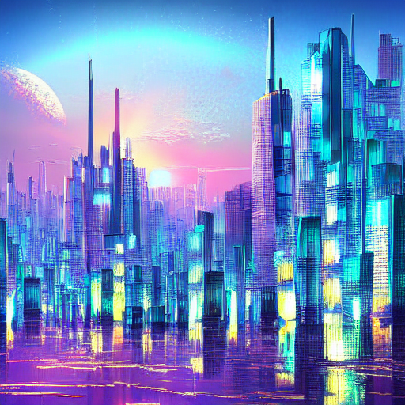
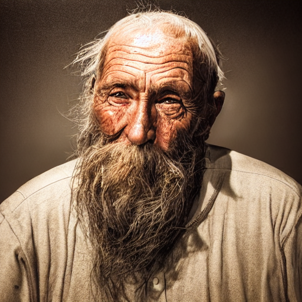
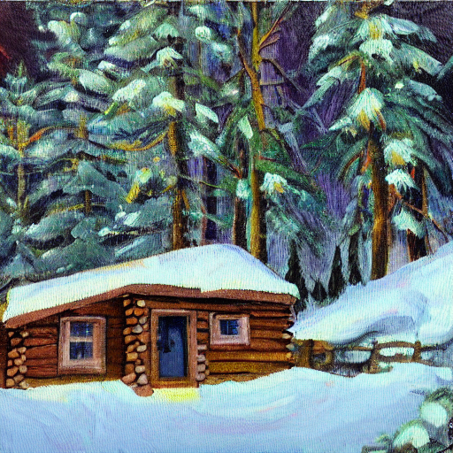
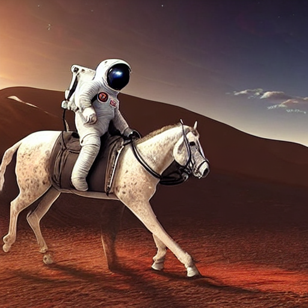
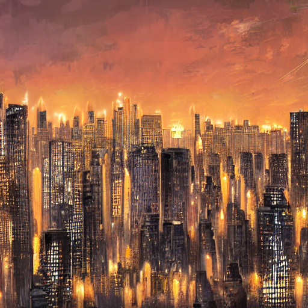
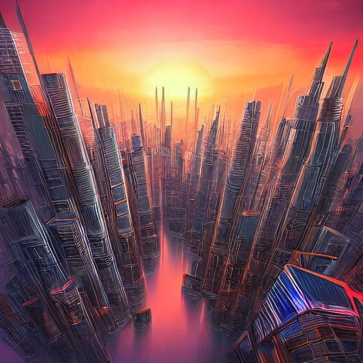
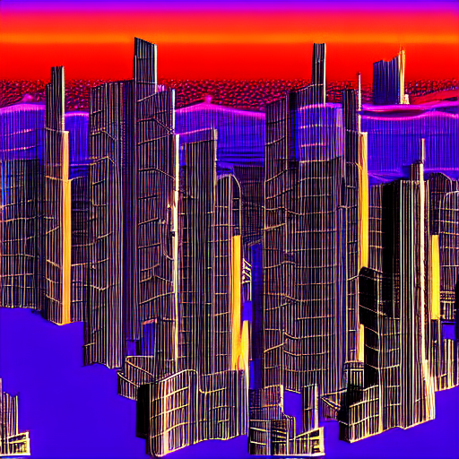
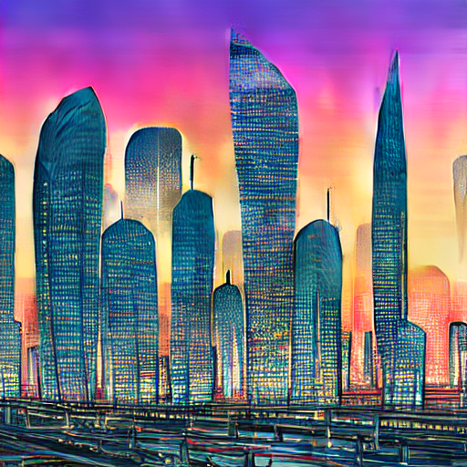
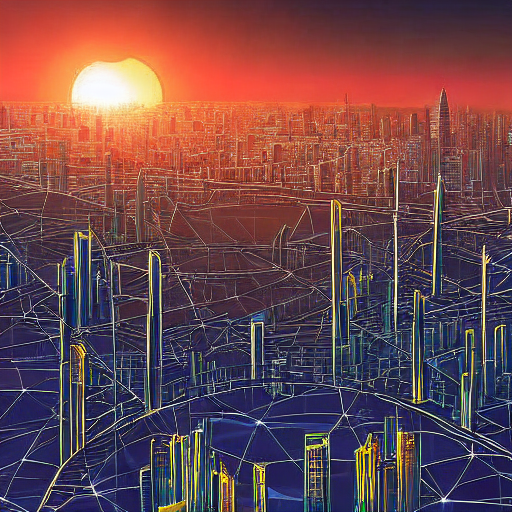
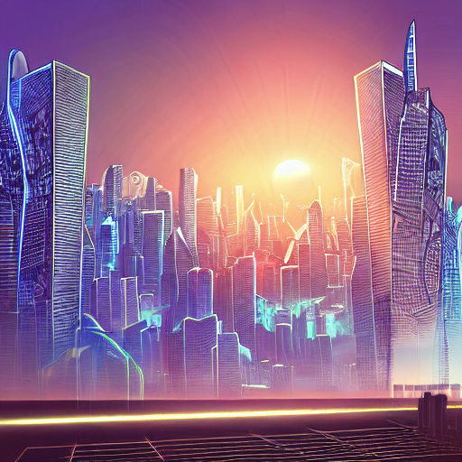

# PRODIGY_GA_02 — Image Generation with Pre-trained Models

## Task
Utilize pre-trained generative models like DALL-E mini or Stable Diffusion to
create images from text prompts.

## Approach
This project uses **Stable Diffusion v1.5** (`runwayml/stable-diffusion-v1-5`)
via Hugging Face's `diffusers` library to generate images purely through
inference — no training or fine-tuning is performed here, since the task is
about correctly using a pre-trained generative pipeline and understanding how
its parameters affect output.

Three things were generated:
1. **Core images** — one image per prompt, across four varied prompts (a
   cityscape, a portrait, a landscape, and a surreal scene) to demonstrate
   range.
2. **Guidance scale comparison** — the same prompt generated at
   `guidance_scale` values of 3, 7.5, and 15.
3. **Inference steps comparison** — the same prompt generated at 10, 25, and
   50 denoising steps.

## How Stable Diffusion Works (Concept Summary)
Stable Diffusion starts from pure random noise and iteratively **denoises**
it over a series of steps, guided by a text prompt encoded via CLIP. Each
step nudges the noise slightly closer to an image that matches the prompt,
operating in a compressed **latent space** rather than directly on pixels
(which is why it's efficient enough to run on a single consumer GPU). This is
fundamentally different from GPT-2's autoregressive next-token prediction
(see [`PRODIGY_GA_01`](https://github.com/anurita-bose/PRODIGY_GA_01)) — one predicts a sequence step by
step, the other refines an entire image step by step.

## Results

### Core Prompts
| Prompt | Image |
|---|---|
| a futuristic city skyline at sunset, digital art | `outputs/image_1.png` |
| a photorealistic portrait of an old fisherman, dramatic lighting | `outputs/image_2.png` |
| a cozy cabin in a snowy forest, oil painting style | `outputs/image_3.png` |
| an astronaut riding a horse on mars, highly detailed | `outputs/image_4.png` |






### Guidance Scale Comparison
Prompt: *"a futuristic city skyline at sunset, digital art"*

| guidance_scale = 3 | guidance_scale = 7.5 | guidance_scale = 15 |
|---|---|---|
|  |  |  |

Lower guidance scale produces more abstract, loosely-prompt-related images;
higher guidance scale produces images that adhere more literally and rigidly
to the prompt's described elements.

### Inference Steps Comparison
Prompt: *"a futuristic city skyline at sunset, digital art"*

| 10 steps | 25 steps | 50 steps |
|---|---|---|
|  |  |  |

Fewer steps produce coarser, less refined images since the denoising process
is cut short; more steps allow finer detail to resolve, at the cost of longer
generation time.

## How to Run
```bash
pip install -r requirements.txt
python image_generation.py
```
Generates all images into `outputs/`, `outputs/guidance_comparison/`, and
`outputs/steps_comparison/`.

## What I Learned
Working with a pre-trained diffusion model highlighted how different
generative paradigms can be — Stable Diffusion doesn't generate token-by-token
like GPT-2, but instead refines an entire image simultaneously through
iterative denoising in latent space. I also learned how two key parameters
trade off against each other: `guidance_scale` controls prompt-adherence vs.
creative freedom, while `num_inference_steps` controls output quality vs.
generation speed — understanding these trade-offs matters more for using
these models well than the specific prompts chosen.

## Tech Stack
- Python, PyTorch
- Hugging Face `diffusers` (Stable Diffusion v1.5)
- Google Colab (T4 GPU)
